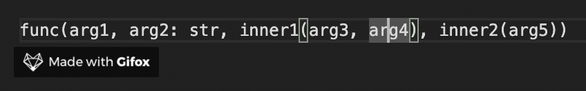
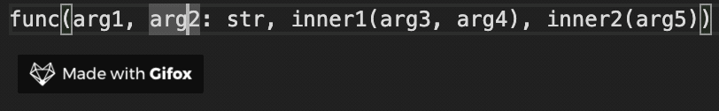
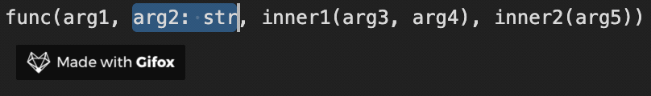

# argselect

A VS Code extension for selecting and manipulating arguments (or parameters) of functions.

## Added Commands

### `argselect.selectArg`
_default keybinding: `ctrl+up`_

This command expands the current selection to include increasingly more of the current argument:

### `argselect.moveArgLeft` and `argselect.moveArgRight`
_default keybindings: `ctrl+left`, `ctrl+right`_

If nothing is selected, these commands move the cursor one argument to the left or right:

    
However, if parts of one or more arguments are selected, these commands move the selected argument(s) to the left or right:

### `argselect.selectArgLeft` and `argselect.selectArgRight`
_default keybindings: `shift+ctrl+left`, `shift+ctrl+right`_

These commands move the cursor one argument to the left or right, highlighting text along the way.

## Added Settings

This extension does not currently add any settings.

## Requirements

This extension has no requirements.

## Known Issues

See https://github.com/JamesMcClung/argselect/issues

## Release Notes

### 2.0.0

Added `argselect.selectArgLeft` and `argselect.selectArgRight` commands.

### 1.2.0

Fixed several bugs related to jumping across and within strings.

### 1.1.0

Fixed a bug that caused each command to fail when the arguments contained a string.

### 1.0.0

Added `argselect.selectArg`, `argselect.moveArgLeft`, and `argselect.moveArgRight` commands.
